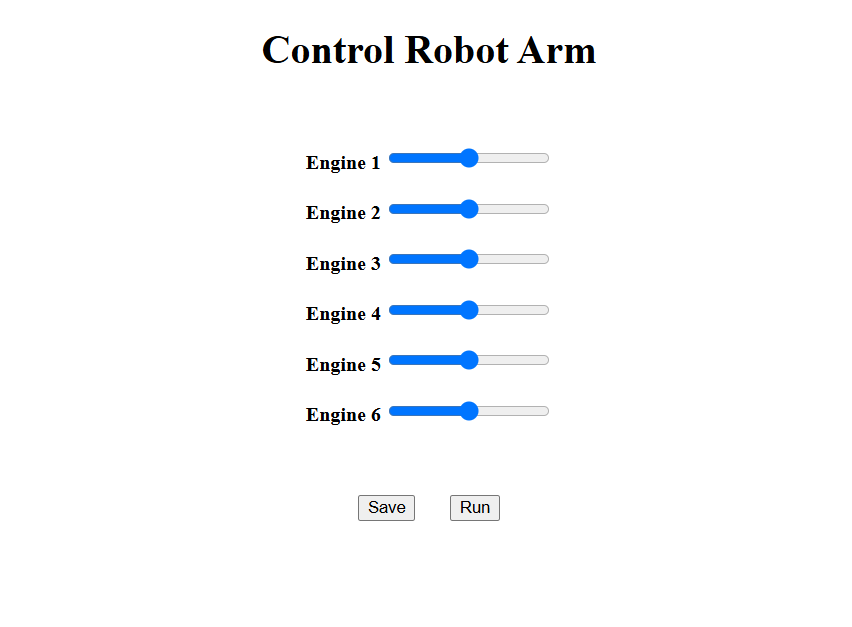

# Robot Arm Web Controller

A web-based interface to control a 6-engine robotic arm. This tool allows users to adjust the position of each engine using intuitive sliders, and communicate with a backend system built with PHP and MySQL to save or execute movement commands.

---

## 🔧 Technologies Used

- **Frontend**: HTML, CSS
- **Backend**: PHP
- **Database**: MySQL

---

## 📷 Interface Preview



---

## 💡 Features

- Control 6 robotic arm motors via sliders
- Save current motor positions to a database
- Run previously saved movements
- Clean, simple web interface

---

## 🚀 How to Use

1. Clone the repository
2. Set up a local server (e.g., XAMPP)
3. Import the `robotarm.sql` file into MySQL
4. Open `robot-arm-test.php` in your browser
5. Use sliders to control the motors
6. Click **Save** to store the position, or **Run** to execute it

---

## 📁 Project Structure

```bash
robot-arm-web-controller/
├── css/
│   └── robot-arm-style.css
├── php/
│   ├── robot-arm-dbc.php
│   └── robot-arm-test.php
├── sql/
│   └── robotarm.sql
├── index.html
└── README.md
```


---

## 📌 Notes

- Make sure PHP and MySQL are properly configured on your server.
- This controller can be integrated with physical robotic systems via serial or wireless communication.


